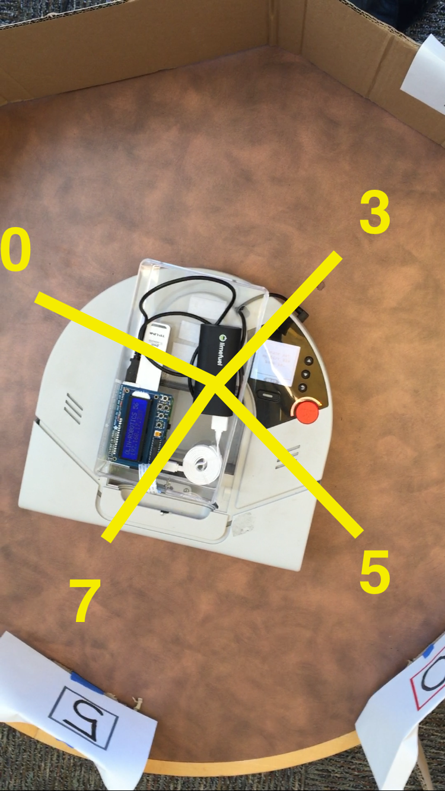
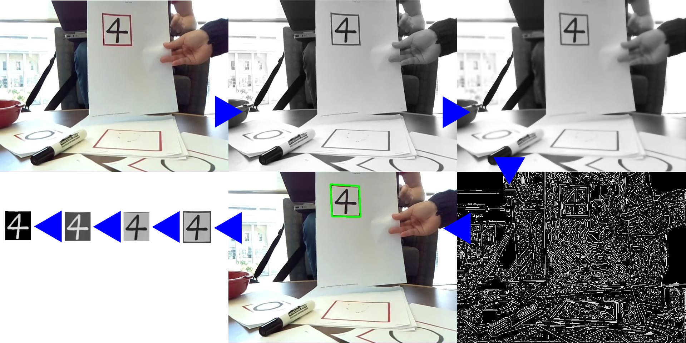
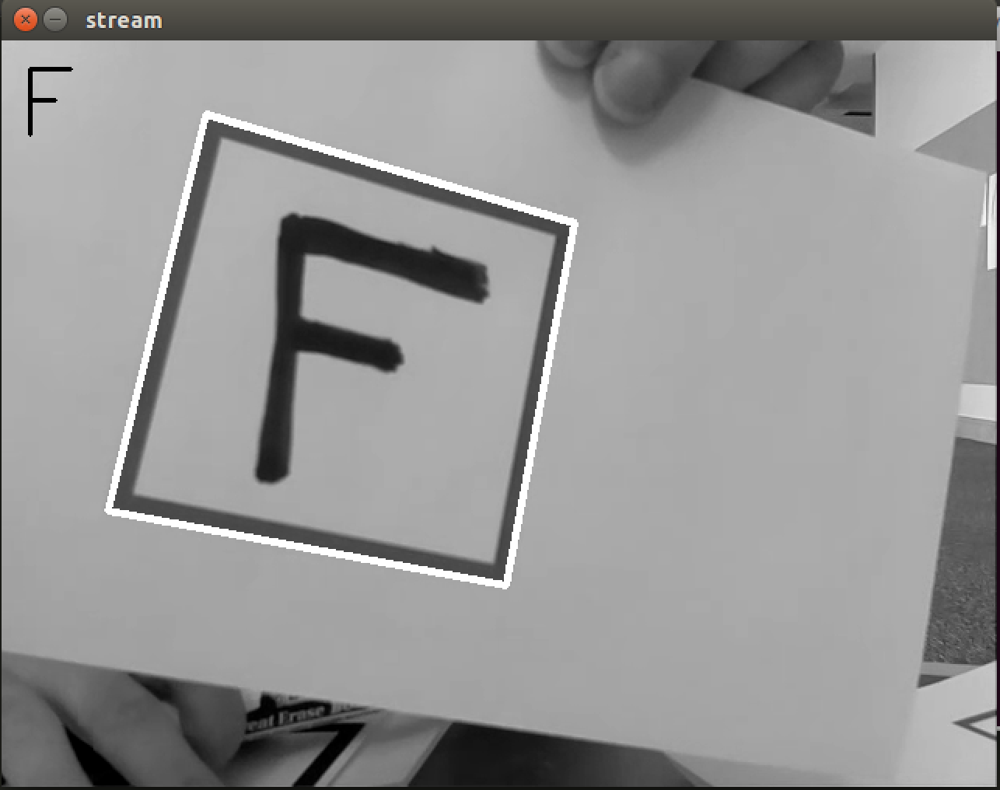
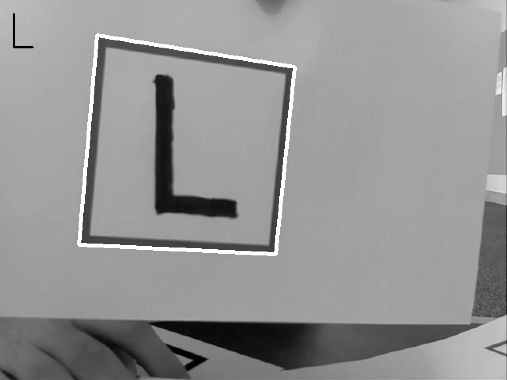
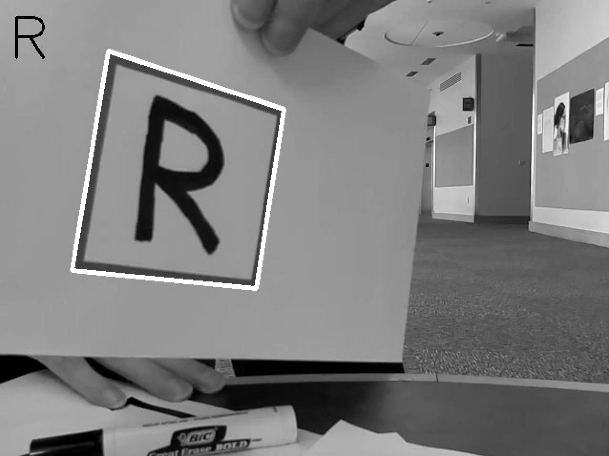

# Optical Character Recognition (OCR)
Computational Robotics, Fall 2015, Computer Vision Project

<Setting of our experiment>

We've built a ROS Package that uses the Neato's camera to detect signs containing a character, such as a digit from 0 to 9 or a letter, and a machine learning model to predict what the character is.

<a href="https://www.youtube.com/watch?v=1gujZN9T9l8" target="_blank">Here</a> you can find a video of our project in action.

## System 
The system consists of handwritten signs and a neato. Neato will recognize a sign and extract a part of the sign within a square box. The extracted part will go through image processing, and the processed image will be put into a model that will give us a probability of how likely an image represents a certain number by comparing the features stored in the model. Once the whole image processing and guessing process is done, neato will change its behavior in a certain way. The video above shows one of the examples, where the neato turns in position to a number, similar to a clock, but with digits of zero to nine. 

## Design
A design decision we had to make was how to deal with noise. The model will predict a digit for whatever the Neato extracts as a sign from what it sees, even if there is not actually a sign present, so we needed to filter the predictions in some way. The first thing that we did was check the probability that the model assigned to its prediction and only accept it if the confidence was over 50%. We also added a sliding window of 5 frames and only used the predictions if they all agreed for those frames. Together, these measures were very successful at making it so that the Neato would only act when it was actually reading a sign.

Another design decision we made was to limit where the sign is written by having a square box of a certain size. From the experimental data, we have found out that the digits should be drawn with a certain thinkness to increase a similarity with the train dataset, which will maximize the probability of a certain feature. 

### Choosing a model

One of the goals of this project was to learn about machine learning since neither of us had used it before. To this end, we utilized scikit-learn and the models and datasets that the library supports. During our experimental phase, we tested out the data prediction with four different models: Logistic Regression, Support Vector Machine, Random Forest, and *k*-Nearest Neighbors. We ended up using the *k*-Nearest Neighbors model as it was relatively easy to understand and performing the best in our experiments.

#### *k*-Nearest Neighbors (*k*-NN)
The <a href="https://en.wikipedia.org/wiki/K-nearest_neighbors_algorithm" target="_blank">*k*-NN algorithm</a> works by finding the *k* training data points closest to the test data. The classification of the test data is made based on which category (in our case, which character) these neighbors fall into.

Image from Wikipedia.

In the image above, the green circle (the test data) would be classified as a red triangle for *k* = 3 but a blue square for *k* = 5 if each neighbor is weighted equally. Sometimes the neighbors are weighted relative to their distance from the test data, in which case it would be possible for the green circle to be classified as a red triangle even for *k* = 5.

In our implementation, we used scikit-learn's `KNeighborsClassifier` with `GridSearchCV` to sweep over different parameters such as the value of *k* and the weighting method.

## Software Architecture
A diagram below shows a software architecture of the system.

Our system divides up into two major parts. Model creation, and image processing. Model creation is where we collect dataset, use it to create a model and save the model. Image processing happens in the main function, and its steps are shown in the image below. With the created model and a procssed image, the program will give us a list of probabilities of how likely the processed image represents a certain number and the final output shows us the best guess over the past five frames.

## Challenges
One challenge that took us far too long to notice was our image data not matching our training data. In the MNIST handwritten digits dataset that comes with scikit-learn, the grayscale intensities were integers ranging from 0 to 16. On the other hand, the grayscale images we were getting from the camera had integer intensities ranging from 0 to 255, so we had to rescale our image data to be like the data our model was trained on. 

The other challenge was that finding a handwritten letter dataset, though we were able to find image files for each alphabet letters, converted into a matrices, and created a model. This part will be further explained in the following section. 

## Future Work
We tried implementing the letter recognition as well once we were confident with the digits recognition. 
As you can see in the figures, we started with the three letters, F, L, and R each representing forward, left, and right. The system that we were interested in was to combine the letter recognition and digit recognition to change the neato's behavior, for example, F-5 will make neato go straight with a linear speed of 0.5 times a constant and etc. 

However, due to a limited time and having a hard time finding an accessible handwritten dataset, we could not make a lot of progress on the letter recognition. So we would be interested in using both letter and digit datasets to create a system and expanding the letters so that the neato can recognize all 26 characters with decent accuracy.

## Lessons
A lesson we learned is that you should always know what the dataset you use looks like. What dimensions are the images? Are they flattened into 1D arrays? What are the intensity values? Is it dark foreground on light background or vice-versa? This is important to know because you must get the data you want your model to make a prediction about into the same format of the data the model was trained on in order to get good results.
