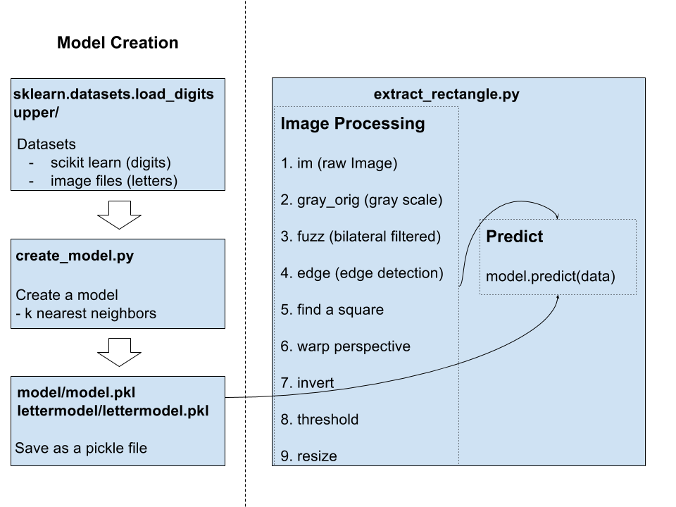

# Optical Character Recognition (OCR)
Computational Robotics, Fall 2015, Computer Vision Project

We've built a ROS Package that uses the Neato's camera to detect signs containing a character, such as a digit from 0 to 9 or a letter, and a machine learning model to predict what the character is.

[Here](http://) You can find a video of our project.

## System 
The system consists of handwritten signs and a neato. Neato will recognize a sign and extract a part of the sign within a square box. The extracted part will go through image processing, and 

## Design
A design decision we had to make was how to deal with noise. The model will predict a digit for whatever the Neato extracts as a sign from what it sees, even if there is not actually a sign present, so we needed to filter the predictions in some way. The first thing that we did was check the probability that the model assigned to its prediction and only accept it if the confidence was over 50%. We also added a sliding window of 5 frames and only used the predictions if they all agreed for those frames. Together, these measures were very successful at making it so that the Neato would only act when it was actually reading a sign.

Another design decision we made was to limit where the sign is written by having a square box of a certain size. From the experimental data, we have found out that the digits should be drawn with a certain thinkness to increase a similarity with the train dataset, which will maximize the probability of a certain feature. 

## Software Architecture

A diagram below shows a software architecture of the system.

Our system divides up to two major part. Model creation, and image processing. Model creation is where we collect dataset, use it to create a model and save the model. Image processing happens in the main function and 

## Challenges
One challenge that took us far too long to notice was our image data not matching our training data. In the MNIST handwritten digits dataset that comes with scikit-learn, the grayscale intensities were integers ranging from 0 to 16. On the other hand, the grayscale images we were getting from the camera had integer intensities ranging from 0 to 255, so we had to rescale our image data to be like the data our model was trained on.

## Future Work
One of the future work that we are interested in is to have a system that incorporates both digits and letter, such that letter tells the neato to move left, right or go staight, and digits set the speed of a certain behavior. 

## Lessons
A lesson we learned is that you should always know what the dataset you use looks like. What dimensions are the images? Are they flattened into 1D arrays? What are the intensity values? Is it dark foreground on light background or vice-versa? This is important to know because you must get the data you want your model to make a prediction about into the same format of the data the model was trained on in order to get good results.
